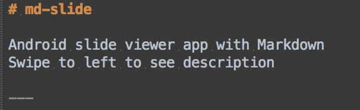
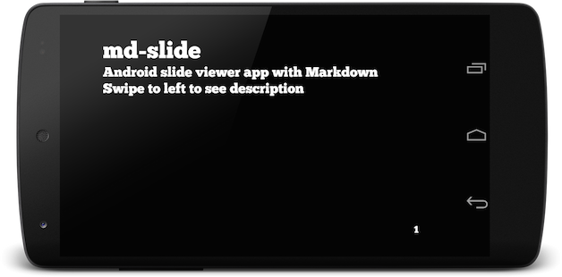

# md-slide for Android

Markdown viewer for presentation with Android device.

Markdown:  

App:  

## Usage

Currently, only the `Intent` can be used.  
Share `.md` file from file explorer apps, and choose `md-slide`.

## Examples

Examples are in the assets directory and you can see them from the navigation drawer.

## License

    Copyright 2014 Soichiro Kashima

    Licensed under the Apache License, Version 2.0 (the "License");
    you may not use this file except in compliance with the License.
    You may obtain a copy of the License at

        http://www.apache.org/licenses/LICENSE-2.0

    Unless required by applicable law or agreed to in writing, software
    distributed under the License is distributed on an "AS IS" BASIS,
    WITHOUT WARRANTIES OR CONDITIONS OF ANY KIND, either express or implied.
    See the License for the specific language governing permissions and
    limitations under the License.

### License of fonts

#### Miguフォント

    Copyright (C) 2002-2013 M+ FONTS PROJECT
    Copyright(c) Information-technology Promotion Agency, Japan (IPA), 2003-2011.

    このフォントのライセンスは、
    IPAフォントのライセンスに準じます。
    
    IPAフォントのライセンスは、配布物に含まれる
    IPA_Font_License_Agreement_v1.0.txt
    をご覧ください。

#### Roboto

    Font data copyright Google 2012

    Licensed under the Apache License, Version 2.0 (the "License");
    you may not use this file except in compliance with the License.
    You may obtain a copy of the License at

        http://www.apache.org/licenses/LICENSE-2.0

    Unless required by applicable law or agreed to in writing, software
    distributed under the License is distributed on an "AS IS" BASIS,
    WITHOUT WARRANTIES OR CONDITIONS OF ANY KIND, either express or implied.
    See the License for the specific language governing permissions and
    limitations under the License.

#### Source Code Pro

    Copyright 2010, 2012 Adobe Systems Incorporated (http://www.adobe.com/), with Reserved Font Name 'Source'. All Rights Reserved. Source is a trademark of Adobe Systems Incorporated in the United States and/or other countries.

    This Font Software is licensed under the SIL Open Font License, Version 1.1.
    This license is copied below, and is also available with a FAQ at: http://scripts.sil.org/OFL

#### Source Sans Pro

    Copyright 2010, 2012 Adobe Systems Incorporated (http://www.adobe.com/), with Reserved Font Name 'Source'. All Rights Reserved. Source is a trademark of Adobe Systems Incorporated in the United States and/or other countries.

    This Font Software is licensed under the SIL Open Font License, Version 1.1.
    This license is copied below, and is also available with a FAQ at: http://scripts.sil.org/OFL

#### Source Code Pro

    Copyright 2014 Adobe Systems Incorporated (http://www.adobe.com/), with Reserved Font Name 'Source'. All Rights Reserved. Source is a trademark of Adobe Systems Incorporated in the United States and/or other countries.
    
    This Font Software is licensed under the SIL Open Font License, Version 1.1.
    This license is copied below, and is also available with a FAQ at: http://scripts.sil.org/OFL

#### amatic

    Copyright (c) 2011 by vernon adams (vern@newtypography.co.uk),
    with Reserved Font Names "Amatic" "Amatic Bold" and "Amatic Regular"
    
    This Font Software is licensed under the SIL Open Font License, Version 1.1.
    This license is copied below, and is also available with a FAQ at: http://scripts.sil.org/OFL

#### ChunkFive

    This Font Software is licensed under the SIL Open Font License, Version 1.1.
    This license is copied below, and is also available with a FAQ at: http://scripts.sil.org/OFL

#### lato

    This Font Software is licensed under the SIL Open Font License, Version 1.1.
    This license is copied below, and is also available with a FAQ at: http://scripts.sil.org/OFL

#### Gasper

    Copyright (c) 2012 by Carlos Alonso (http://www.alonsocosta.com  correo@alonsocosta.com),
    with Reserved Font Name "Gaspar" "Gaspar Regular" "Gaspar Regular Italic" "Gaspar Bold" "Gaspar Bold Italic" 
    
    This Font Software is licensed under the SIL Open Font License, Version 1.1.
    This license is copied below, and is also available with a FAQ at: http://scripts.sil.org/OFL

#### Leckerli One

    Copyright (c) 2011 Gesine Todt  (www.gesine-todt.de), with Reserved
    Font Names &quot;Leckerli&quot; and &quot;Leckerli One&quot;.
    
    This Font Software is licensed under the SIL Open Font License, Version 1.1.
    This license is copied below, and is also available with a FAQ at: http://scripts.sil.org/OFL

#### amble

    Designed by Punchcut

    Licensed under the Apache License, Version 2.0 (the "License");
    you may not use this file except in compliance with the License.
    You may obtain a copy of the License at

        http://www.apache.org/licenses/LICENSE-2.0

    Unless required by applicable law or agreed to in writing, software
    distributed under the License is distributed on an "AS IS" BASIS,
    WITHOUT WARRANTIES OR CONDITIONS OF ANY KIND, either express or implied.
    See the License for the specific language governing permissions and
    limitations under the License.
